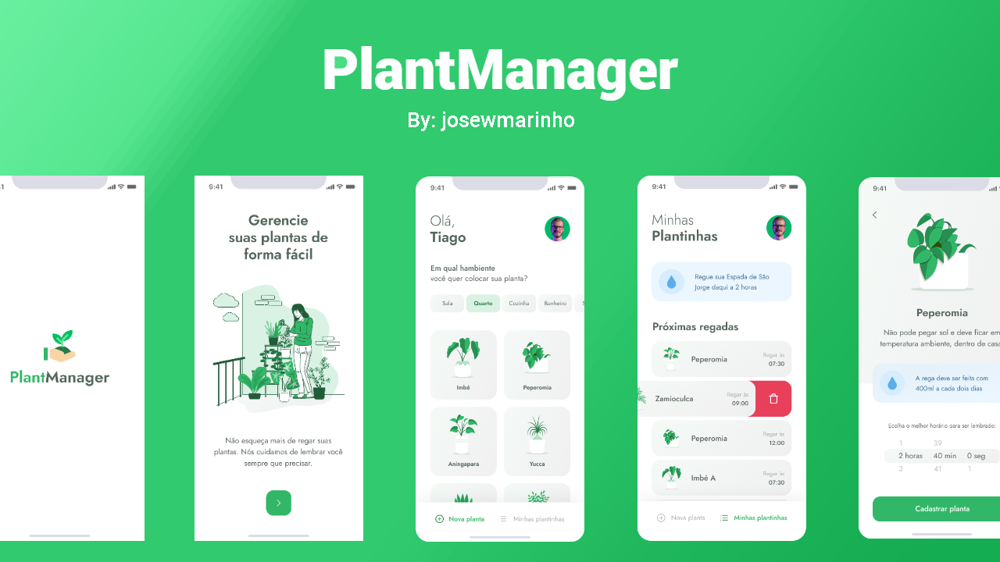

<h1 align="center">
    
</h1>

<div align="center">
    
    <a href="https://www.linkedin.com/in/josewportomarinhojr/" target="_blank" rel="josewportomarinhojr">
      
    </a>
    
  </p>
</div>

<p align="center">
    <a href="README.md">English</a>
    ·
    <a href="README-pt.md">Português</a>
 </p>

<div align="center">
  
</div>

<br>
<br>

> :rocket: Projeto criado para ajudar as pessoas a se lembrarem de regar as plantas. Feito na Next Level Week #5 @Rocketseat

<div align="center">
  <sub>O Projeto da NLW #5. Feito por:
    <a href="https://github.com/josewmarinho">José Wellington</a>
  </sub>
</div>

# 🚀 Tecnologias

  - [Node.js](https://nodejs.org/en/)
  - [Expo](https://expo.io/)
  - [React Native](https://reactnative.dev/)
  - [TypeScript](https://www.typescriptlang.org/)
  - [ESlint](https://eslint.org/)
  - [Prettier](https://prettier.io/)
  - [EditorConfig](https://editorconfig.org/)


## 💻 Começando

### Requerimentos

- [Node.js](https://nodejs.org/en/)
- [Expo](https://expo.io/)
- [Yarn](https://classic.yarnpkg.com/) or [NPM](https://www.npmjs.com/)

### 📱  Instalando e executando o projeto

*Clone o projeto e acesse a pasta*

```bash
$ git clone https://github.com/josewmarinho/Plantmanager
$ cd Plantmanager
```

*Siga os passos abaixo*

```bash
# Instale as dependências
$ yarn install

# Faça uma cópia de '.env.example' para '.env'
# e definir com SUAS variáveis ​​de ambiente.
$ cp .env.example .env

# Por fim, execute o serviço api em um ambiente de desenvolvimento :)
$ yarn start

# Muito bem, PlantManager é iniciado!

Depois leia o QRCode com o app do [expo](https://play.google.com/store/apps/details?id=host.exp.exponent) ou rode em um emulador.
```
<br>

# :closed_book: License

Lançado em 2020 :closed_book: Licencia

Feito por [José Wellington](https://github.com/josewmarinho) 🚀.
Esse projeto esta sobre [MIT license](./LICENSE).

Dê uma ⭐️ se esse projeto te ajudou!
